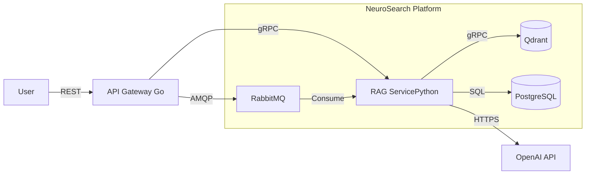

# NeuroSearch Core

**NeuroSearch Core** is an enterprise-grade RAG (Retrieval-Augmented Generation) platform designed for high-performance semantic search and document analysis. It leverages a polyglot microservices architecture to ensure scalability, low latency, and reliability.

---

## System Architecture

The system consists of two primary services communicating via **gRPC**:

1.  **API Gateway (Go):** High-performance entry point handling REST traffic, validation, and gRPC routing.
2.  **RAG Service (Python):** Core logic engine handling embedding generation, vector search (Qdrant), and LLM orchestration (LangChain).

### Infrastructure Stack
*   **Vector Database:** Qdrant (Rust-based, high performance)
*   **Primary Database:** PostgreSQL (Async SQLAlchemy)
*   **Message Broker:** RabbitMQ (Ingestion pipeline)
*   **Observability:** Prometheus (Metrics scraping)



---

## Quick Start

### Prerequisites
*   Docker & Docker Compose
*   OpenAI API Key

### Installation

1.  **Clone the repository:**
    ```bash
    git clone https://github.com/Birzhan20/neuro_search_core.git
    cd neuro-search-core
    ```

2.  **Configure Environment:**
    Create a `.env` file in `services/rag_service/`:
    ```bash
    OPENAI_API_KEY=sk-your-key-here
    POSTGRES_USER=user
    POSTGRES_PASSWORD=password
    POSTGRES_DB=neurosearch
    ```

3.  **Start Services:**
    ```bash
    docker-compose up -d --build
    ```

4.  **Verify Status:**
    The API Gateway will be available at `http://localhost:8080`.

---

## API Reference

### Chat with Documents
**POST** `/api/v1/chat`

Allows users to ask natural language questions based on the knowledge base.

**Request:**
```json
{
  "message": "What are the functional requirements for ingestion?"
}
```

**Response:**
```json
{
  "answer": "The system must support ingestion of .pdf, .docx, and .txt files with 256-token chunking.",
  "session_id": "59eae675-1d5f-4e3f-957e-ae0bd13e5634",
  "sources": [
    {
      "doc_name": "PRD.pdf",
      "page": 3,
      "score": 0.89
    }
  ]
}
```

---

## Observability

The system exports Prometheus metrics for monitoring performance and reliability.

| Service | Metrics Endpoint | Port |
|---------|------------------|------|
| **API Gateway** | `/metrics` | `8080` |
| **RAG Service** | `/metrics` | `9090` |
| **Prometheus UI** | - | `9091` |

**Key Metrics:**
*   `rag_request_latency_seconds`: End-to-end RAG pipeline latency.
*   `rag_vector_search_seconds`: Time taken for Qdrant retrieval.
*   `gateway_requests_total`: Total ingress traffic.

---

## Development

### Directory Structure
```
.
├── api
│   └──openapi.yaml      # OpenAPI specification for API Gateway (Swagger)
├── docs
│   ├──architecture      # System architecture overview (C4 diagrams)
│   ├──decisions         # Design decisions and rationale (ADRs)
│   └──product_requirement_document.md 
│
├── services
│   ├── api_gateway      # Go Service (Gin, gRPC Client)
│   └── rag_service      # Python Service (LangChain)
├── protos               # Shared Protocol Buffers definitions
├── docs                 # Architecture & Design docs
└── docker-compose.yml   # Orchestration
```

### Protocol Buffers
To regenerate gRPC code for both languages:
```bash
make gen-proto
```

---

## License
MIT License.
