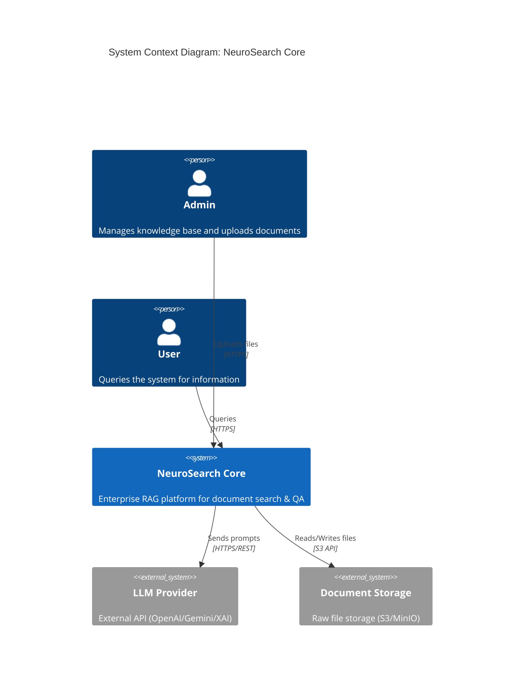

# C4 Level 1: System Context

Diagram of the system context. The boundaries of the system and the interaction with external actors.

```mermaid
C4Context
    title System Context Diagram: NeuroSearch Core

    Person(admin, "Admin", "Manages knowledge base and uploads documents")
    Person(user, "User", "Queries the system for information")

    System(system, "NeuroSearch Core", "Enterprise RAG platform for document search & QA")

    System_Ext(llm_provider, "LLM Provider", "External API (OpenAI/Gemini/XAI)")
    System_Ext(storage, "Document Storage", "Raw file storage (S3/MinIO)")

    Rel(admin, system, "Uploads files", "HTTPS")
    Rel(user, system, "Queries", "HTTPS")
    Rel(system, llm_provider, "Sends prompts", "HTTPS/REST")
    Rel(system, storage, "Reads/Writes files", "S3 API")
```