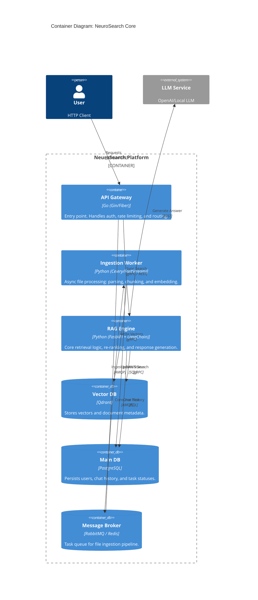

# C4 Level 2: Container Diagram

Container diagram. It shows a high-level technical architecture and interaction protocols.

```mermaid
C4Container
    title Container Diagram: NeuroSearch Core

    Person(user, "User", "HTTP Client")

    Container_Boundary(c1, "NeuroSearch Platform") {
        
        Container(api_gateway, "API Gateway", "Go (Gin/Fiber)", "Entry point. Handles auth, rate limiting, and routing.")
        
        Container(ingestion_service, "Ingestion Worker", "Python (Celery/FastStream)", "Async file processing: parsing, chunking, and embedding.")
        
        Container(rag_service, "RAG Engine", "Python (FastAPI + LangChain)", "Core retrieval logic, re-ranking, and response generation.")
        
        ContainerDb(vector_db, "Vector DB", "Qdrant", "Stores vectors and document metadata.")
        ContainerDb(rel_db, "Main DB", "PostgreSQL", "Persists users, chat history, and task statuses.")
        ContainerDb(queue, "Message Broker", "RabbitMQ / Redis", "Task queue for file ingestion pipeline.")
    }

    System_Ext(llm, "LLM Service", "OpenAI/Local LLM")

    Rel(user, api_gateway, "Requests", "JSON/HTTPS")
    
    Rel(api_gateway, rag_service, "Sync Search", "gRPC / REST")
    Rel(api_gateway, queue, "Ingest Job", "AMQP")
    
    Rel(queue, ingestion_service, "Consume Task", "AMQP")
    
    Rel(ingestion_service, vector_db, "Write Vectors", "gRPC")
    Rel(ingestion_service, rel_db, "Update Status", "SQL")
    
    Rel(rag_service, vector_db, "ANN Search", "gRPC")
    Rel(rag_service, rel_db, "Chat History", "SQL")
    Rel(rag_service, llm, "Generate Answer", "REST")
```