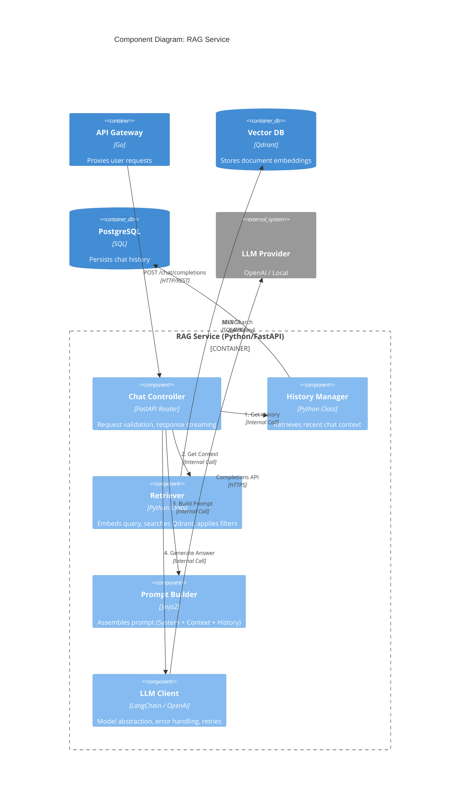

# C4 Level 3: Component Diagram (RAG Service)

Detailed architecture of the response generation service (RAG Engine). Shows the separation of logic within a Python application.

```mermaid
C4Component
    title Component Diagram: RAG Service

    Container(api_gateway, "API Gateway", "Go", "Proxies user requests")
    ContainerDb(vector_db, "Vector DB", "Qdrant", "Stores document embeddings")
    ContainerDb(postgres, "PostgreSQL", "SQL", "Persists chat history")
    System_Ext(llm, "LLM Provider", "OpenAI / Local", "Generates text")

    Container_Boundary(rag_app, "RAG Service (Python/FastAPI)") {
        
        Component(api_handler, "Chat Controller", "FastAPI Router", "Request validation, response streaming")
        
        Component(history_manager, "History Manager", "Python Class", "Retrieves recent chat context")
        
        Component(retriever, "Retriever", "Python Class", "Embeds query, searches Qdrant, applies filters")
        
        Component(prompt_builder, "Prompt Builder", "Jinja2", "Assembles prompt (System + Context + History)")
        
        Component(llm_client, "LLM Client", "LangChain / OpenAI", "Model abstraction, error handling, retries")
    }

    Rel(api_gateway, api_handler, "POST /chat/completions", "HTTP/REST")
    
    Rel(api_handler, history_manager, "1. Get History", "Internal Call")
    Rel(history_manager, postgres, "SELECT", "SQLAlchemy")

    Rel(api_handler, retriever, "2. Get Context", "Internal Call")
    Rel(retriever, vector_db, "ANN Search", "gRPC")

    Rel(api_handler, prompt_builder, "3. Build Prompt", "Internal Call")
    
    Rel(api_handler, llm_client, "4. Generate Answer", "Internal Call")
    Rel(llm_client, llm, "Completions API", "HTTPS")
```