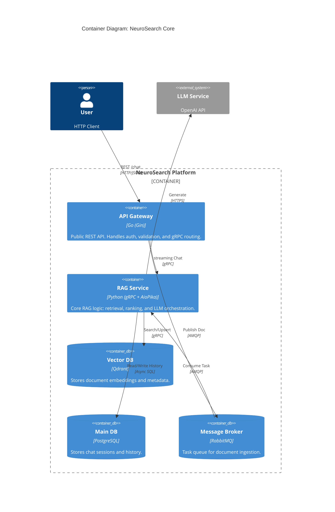

# C4 Level 2: Container Diagram

High-level architecture showing containers and protocols.

```mermaid
C4Container
    title Container Diagram: NeuroSearch Core

    Person(user, "User", "HTTP Client")

    Container_Boundary(c1, "NeuroSearch Platform") {
        
        Container(api_gateway, "API Gateway", "Go (Gin)", "Public REST API. Handles auth, validation, and gRPC routing.")
        
        Container(rag_service, "RAG Service", "Python (gRPC + AioPika)", "Core RAG logic: retrieval, ranking, and LLM orchestration.")
        
        ContainerDb(vector_db, "Vector DB", "Qdrant", "Stores document embeddings and metadata.")
        ContainerDb(rel_db, "Main DB", "PostgreSQL", "Stores chat sessions and history.")
        ContainerDb(queue, "Message Broker", "RabbitMQ", "Task queue for document ingestion.")
    }

    System_Ext(llm, "LLM Service", "OpenAI API")

    Rel(user, api_gateway, "REST /chat", "HTTP/JSON")
    
    Rel(api_gateway, rag_service, "streaming Chat", "gRPC")
    Rel(api_gateway, queue, "Publish Doc", "AMQP")
    
    Rel(queue, rag_service, "Consume Task", "AMQP")
    
    Rel(rag_service, vector_db, "Search/Upsert", "gRPC")
    Rel(rag_service, rel_db, "Read/Write History", "Async SQL")
    Rel(rag_service, llm, "Generate", "HTTPS")
```