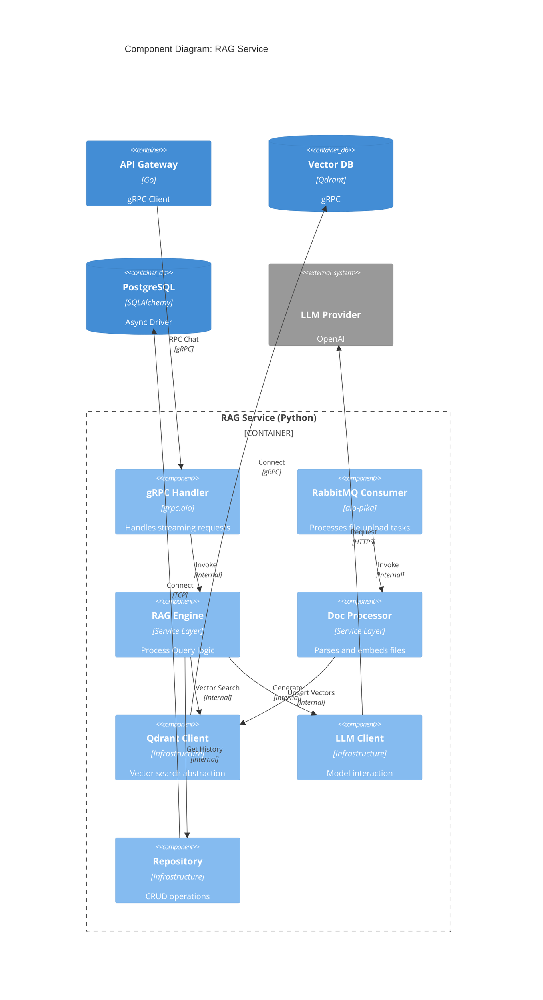

# C4 Level 3: Component Diagram (RAG Service)

Internal architecture of the RAG Service.

```mermaid
C4Component
    title Component Diagram: RAG Service

    Container(api_gateway, "API Gateway", "Go", "gRPC Client")
    ContainerDb(vector_db, "Vector DB", "Qdrant", "gRPC")
    ContainerDb(postgres, "PostgreSQL", "SQLAlchemy", "Async Driver")
    System_Ext(llm, "LLM Provider", "OpenAI", "REST API")

    Container_Boundary(rag_app, "RAG Service (Python)") {
        
        Component(grpc_server, "gRPC Handler", "grpc.aio", "Handles streaming requests")
        Component(rabbitmq_consumer, "RabbitMQ Consumer", "aio-pika", "Processes file upload tasks")
        
        Component(rag_engine, "RAG Engine", "Service Layer", "Process Query logic")
        Component(doc_processor, "Doc Processor", "Service Layer", "Parses and embeds files")
        
        Component(qdrant_client, "Qdrant Client", "Infrastructure", "Vector search abstraction")
        Component(llm_client, "LLM Client", "Infrastructure", "Model interaction")
        Component(db_repo, "Repository", "Infrastructure", "CRUD operations")
    }

    Rel(api_gateway, grpc_server, "RPC Chat", "gRPC")
    
    Rel(grpc_server, rag_engine, "Invoke", "Internal")
    Rel(rabbitmq_consumer, doc_processor, "Invoke", "Internal")

    Rel(rag_engine, db_repo, "Get History", "Internal")
    Rel(rag_engine, qdrant_client, "Vector Search", "Internal")
    Rel(rag_engine, llm_client, "Generate", "Internal")

    Rel(doc_processor, qdrant_client, "Upsert Vectors", "Internal")
    
    Rel(qdrant_client, vector_db, "Connect", "gRPC")
    Rel(db_repo, postgres, "Connect", "TCP")
    Rel(llm_client, llm, "Request", "HTTPS")
```